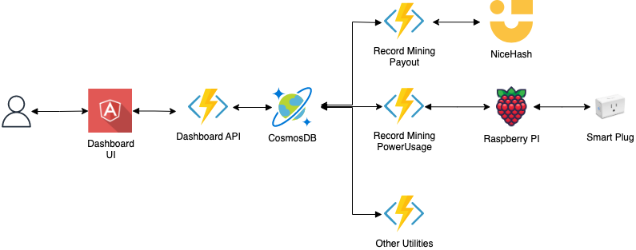

# Crypto
This repository contains projects for a visualizing or collecting data related to my crypto mining and investments.

## Dashboard
The dashboard-ui and dashboard-api projects are an angular and azure function projects used to visualize my crypto mining and investments through azure static web apps.

### Running locally
1. Install node
1. Copy `dashboard-api/local.settings-sample.json` to `dashboard-api/local.settings.json` and fill in any missing values
1. Run the web app emulator: `npx @azure/static-web-apps-cli start`

## Utility Functions
The utility functions projects are a collection of azure functions not used or intended to be exposed in the dashboard. Some examples automatically requesting pool payouts, recording pool payouts, or recording mining power usage.

### Running Locally
1. Install visual studio
1. Install the required .NET sdk
1. Copy `utility-functions/functions/local.settings.json` to `utility-functions/functions/local.settings.json` and fill in any missing values
1. Start the project using the visual studio debugger